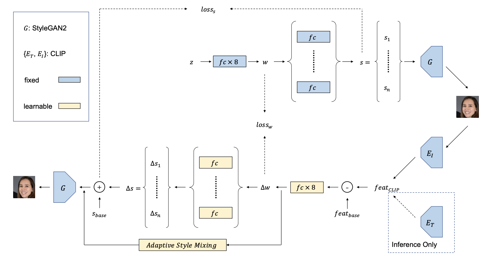
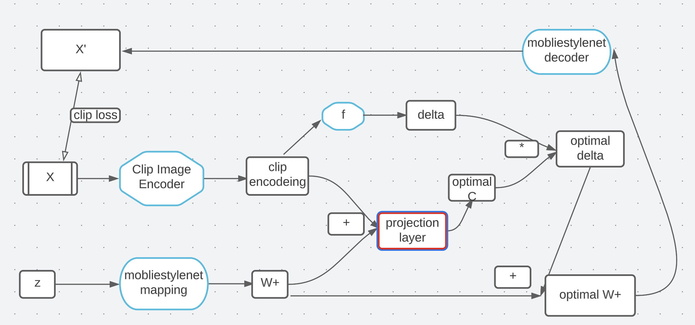

# CelebrtyLook

App that uses GAN inversion and MobileStyleNet to transform your face into that of a celebrity, spefic text, a image of a friend, on the edge.

##Implemntation

using MobileStyleNet that designed to be efficient and fast, making it well-suited for use on mobile devices that trained with distlation of StyleGan2.

We want to have GAN inversion and manipulation on the device so I implemnt the SOTA paper 
["Bridging CLIP and StyleGAN through Latent Alignment for Image Editing"](https://arxiv.org/abs/2210.04506)

the training looking like this:

when G is the MobileStyleNet and $E_I$ distlation of openclip to is a EffiectFormer and $E_T$ is openclip text encoder(dont need for the app).

##Experiments

### GAN Inversion

Gan inversion infrence is very simple:$G(f(E_I(X)))$ when f is the simple layers that are not frozen in the training.

###Generate faces using text
Becouse we use the clip image encoder to train the mapper, we can use the text encoder to create delta W+ from the mean image to image close to a given text.

### Image text manuipulation 

Becouse we use the clip image encoder to train the mapper, we can use the text encoder to create delta W+ from an input W+ to given text.
(the infrance is in the paper)
texts used:
1. asian with pink wig.
2. blond woman with sunglasses.
3. fat man with beard.
4. man with glasses.

	  	
	
	

experiment that dont show in the paper is to do head movment to the image using diffrent texts.
texts used:

1. Donald Trump looking left.
2. Donald Trump looking left.
3. man looking up.

	  	
	

As we can see the model understend very good simple elements such as glasses, sex etc but with more complex text such as looking like celebrite its harder for it(also we as humens who see celebrties many times can see very small errors in the image) but it understands really well also head postion.

### Problem with text manuipulation

as we saw it this method able us to create delta W+ from an input W+ to given text. but, its hard to know how much of the delta we should add to create an image that looks like the
given text, the input W+ image representation.

The problem is that every W+ latent would need difreent constent c to multiply the delta and add to the latent for the best result.

all the examples used from const C to 0 to 0.8(moving every frame the C is getting bigger). bu
example texts used:

1. man with blue eyes and a hat.
2. man with blue eyes and a hat.
3. man with glasses looking up.

	  	
	

As we can see the optimal C can be change even with the same text but diffrent latent to start with.

to solve this problem I craeted new method to find the optimal C for specific W+ latent and text encoding using a simple projection layer, and this training process:

the training process looks compliceted but simpaly put we use clip loss to train the projection layer to find optimal C for W+ latent and text encoding.

clip loss idefenties:

$L_c = mse(C,C_I(X,X')$ 

when $C_I$ is function to find clip similarty between to images and C is hyper parmeter when I used for the traing 0.7 for the best results for balance between the similarty to the input image and similarty for the text input.

